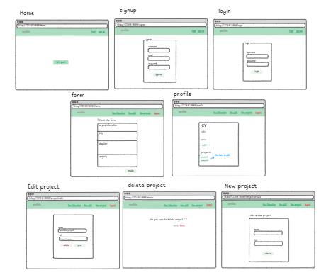
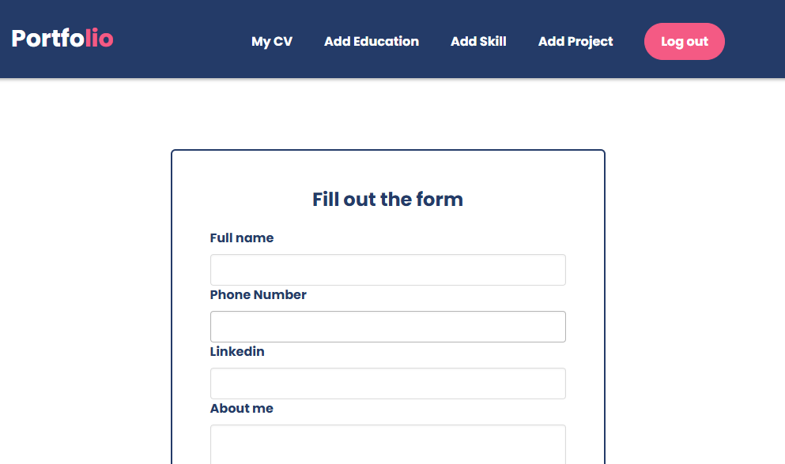
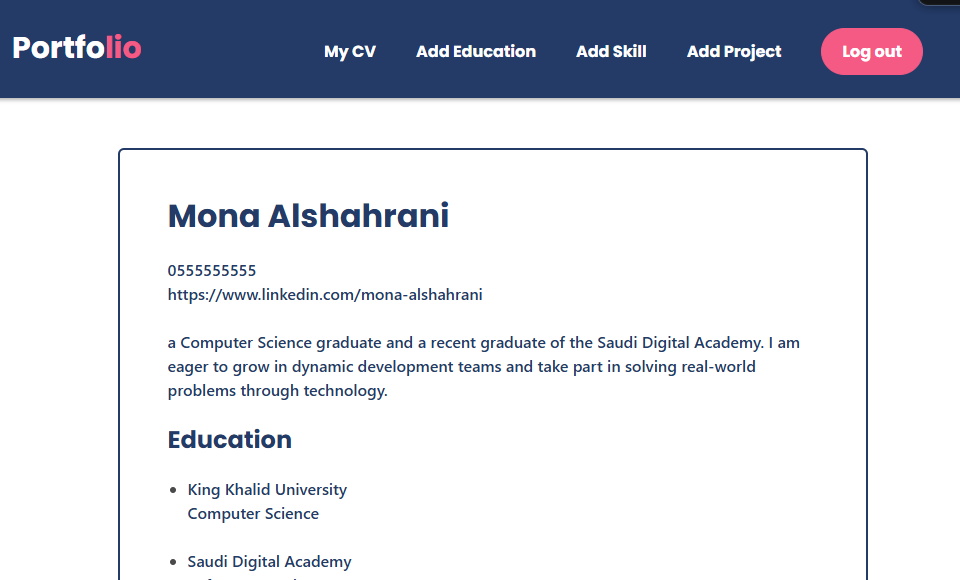
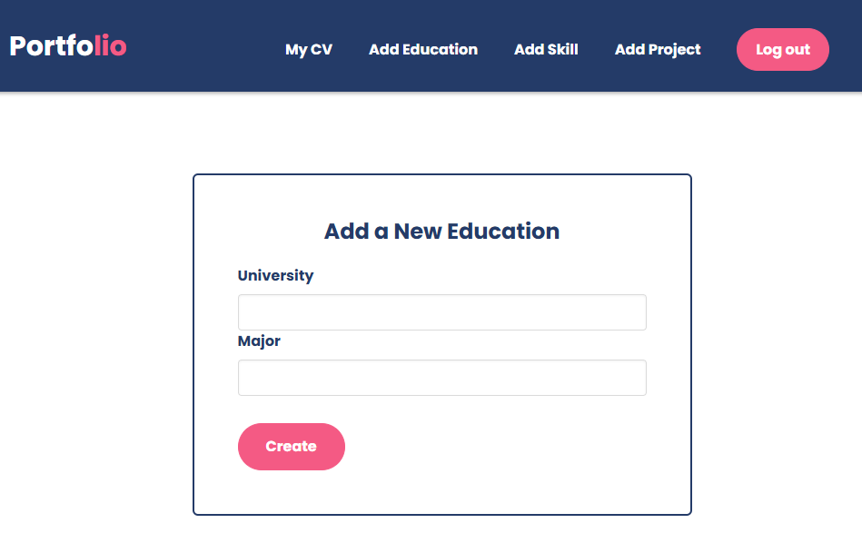
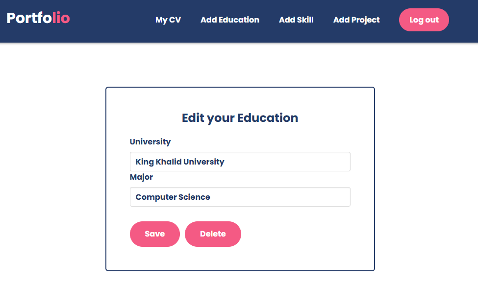

# Personal Portfolio Builder


## Description

The frontend of the Personal Portfolio Builder is built with React.js. It provides a user-friendly interface where users can log in, enter their personal, educational, skills, and project information, and view their portfolio. It includes features like protected routes, form validation, and toast notifications for a smooth user experience. The frontend communicates with the backend through API calls using Axios.


## Tech Stack

- React.js.
- Axios.
- React Router .
- Toast Notifications .


## Backend Repo Link

https://git.generalassemb.ly/mona96m/Portfolio-Backend

## Installation Instructions as Needed

### Install npm
```npm install```
### Run server
```npm run dev```

## Wireframes for the main pages



## Screenshots of the app
### Data filling form

### CV details

### Add a New item

### Update and Delete item



## Icebox Features

- **Download Portfolio Button**
Add a button for users to download their portfolio as a PDF.

- **Cover Letter Form**
Add a simple form for users to write and update a cover letter.


